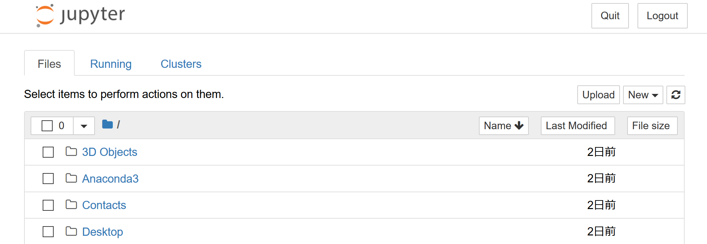
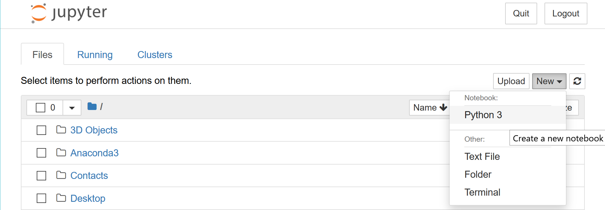
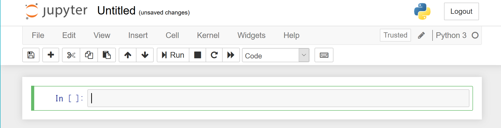

# Pythonの環境構築と使い方（Ubuntu16）

- [環境構築](##環境構築)
    - [pyenvのインストール](###pyenvのインストール)
    - [Anacondaのインストール](###Anacondaのインストール)
    - [仮想環境の作成](###仮想環境の作成)
    - [ライブラリのversion](###ライブラリのversion)
- [Jupyter Notebookの起動](##JupyterNotebookの起動)
- [Matplotlibの設定](##Matplotlibの設定)
    - [日本語の設定](###日本語の設定)
    - [罫線の設定](###罫線の設定)

## 環境構築

### pyenvのインストール

bashではなくzshなどをお使いの方は適宜`.bashrc`を`.zshrc`に変更してください。

```
$ git clone git://github.com/yyuu/pyenv.git ~/.pyenv
$ git clone https://github.com/yyuu/pyenv-pip-rehash.git ~/.pyenv/plugins/pyenv-pip-rehash
$ echo 'export PYENV_ROOT="$HOME/.pyenv"' >> ~/.bashrc
$ echo 'export PATH="$PYENV_ROOT/bin:$PATH"' >> ~/.bashrc
$ echo 'eval "$(pyenv init -)"' >> ~/.bashrc
$ source ~/.bashrc
```

### Anacondaのインストール

PythonのインストールはAnacondaをオススメします。
Anacondaは科学技術計算用のライブラリ群があらかじめパッケージングされたPythonです。

まずはインストールできるAnacondaの一覧を取得しましょう。
```
$ pyenv install -l | grep anaconda3
  anaconda3-2.0.0
  anaconda3-2.0.1
  anaconda3-2.1.0
  anaconda3-2.2.0
  anaconda3-2.3.0
  anaconda3-2.4.0
  anaconda3-2.4.1
  anaconda3-2.5.0
  anaconda3-4.0.0
  anaconda3-4.1.0
  anaconda3-4.1.1
  anaconda3-4.2.0
  anaconda3-4.3.0
  anaconda3-4.3.1
  anaconda3-4.4.0
  anaconda3-5.0.0
  anaconda3-5.0.1
  anaconda3-5.1.0
  anaconda3-5.2.0
```

最新のものをインストールします。8/31現時点ではanaconda3-5.2.0が最新のようです。
```
$ pyenv install anaconda3-5.2.0
$ pyenv global anaconda3-5.2.0
$ echo 'export PATH="$PYENV_ROOT/versions/anaconda3-5.2.0/bin:$PATH"' >> ~/.bashrc
$ source ~/.bashrc
```

### 仮想環境の作成

本書専用の仮想環境を作ります。
ここではpystという名前で作成していますが、好きな名前で作成してもらって構いません。

```
$ conda create -n pyst python=3.6 anaconda
$ source activate pyst
```

### ライブラリのversion

本書のコードは次のバージョンで実行できることを確認しています。

|パッケージ名|バージョン|
|:-:|:-:|
|python|3.6.5|
|jupyter|1.0.0|
|ipython|6.2.1|
|notebook|5.5.0|
|numpy|1.14.3|
|pandas|0.23.0|
|matplotlib|2.2.2|
|statsmodels|0.9.0|

ライブラリのバージョンは次のコマンドで確認できます。
```
(pyst)$ conda list
```

特にipythonのバージョンによってはnotebookで桁数を抑制するための
```python
%precision 3
```
がうまく動かない場合があります。
その場合は、次のコマンドでバージョン6.2のipythonをインストールしてください。
```
(pyst)$ conda install ipython=6.2
```

## JupyterNotebookの起動

Jupyter Notebookは次のコマンドで起動します。
コマンドを実行したディレクトリで起動するため、作業ディレクトリに`cd`してから起動するのがいいでしょう。

```
(pyst)$ jupyter notebook
```

ブラウザが立ち上がり次のような画面が出ていれば成功です。



notebookは次のようにして立ち上げることができます。



notebookが立ち上がると次のようになります。
ここにコードを記述すると実行できるようになります。



## Matplotlibの設定

Matplotlibの設定はmatplotlibrcというファイルで変更できます。  
[このnotebook](https://github.com/ghmagazine/python_stat_sample/blob/master/tutorial/matplotlib_ja.ipynb)
の最初のセルを実行してmatplotlibrcの場所を調べましょう。

matplotlibrcにはいろいろと記述されていると思いますが、これまで特に設定を変更していなければ、それらはすべてコメントアウトされている行になっているはずです。  
そのため、これからmatplotlibの設定するにあたって、それらの行はすべて消してもらっても構いません。

### 日本語の設定

Takaoゴシックというフォントが使えるはずです。
matplotlibrcに次の1行を追記してください。
```
font.family: TakaoGothic
```

最後に[このnotebook](https://github.com/ghmagazine/python_stat_sample/blob/master/tutorial/matplotlib_ja.ipynb)を実行して、日本語表示できているか確認してみましょう。

### 罫線の設定
本書のようにグラフに罫線を出力したい場合は、さらに次の設定もmatplotlibrcに追記してください。

```
axes.grid: True
axes.axisbelow: True
grid.alpha: 0.5
```
